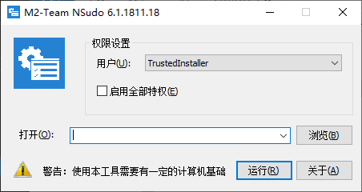


# NSudo - 一个强大的系统管理工具

[![appveyor.badge]][appveyor.link] 
[![release.badge]][release.link]
[![latestdownloads.badge]][latestdownloads.link]
[![totaldownloads.badge]][totaldownloads.link]
[![license.badge]][license.link]

- [繁體中文](說明.md)
- [English](Readme.md)



- 注意：NSudo基于raymai97的超级命令提示符，请参阅 
  [这里](http://bbs.pcbeta.com/viewthread-1508863-1-1.html "这里") 以获取更多关
  于超级命令提示符的信息。

## 介绍
以下是与NSudo有关的第三方介绍链接。
- MajorGeeks: https://www.majorgeeks.com/files/details/nsudo.html
- softpedia.com: https://www.softpedia.com/get/Tweak/System-Tweak/NSudo.shtml
- TrishTech.com: https://www.trishtech.com/2018/11/nsudo-run-programs-with-full-privileges-in-windows/
- Wilders Security Forums: https://www.wilderssecurity.com/threads/396818

## 系统要求
- 支持的系统版本：Windows NT 6.0 及之后版本
- 支持的处理器架构：x86, x86-64(AMD64), ARM, ARM64

## 使用方法
- 请打开【CPU 架构】目录，然后双击 NSudo.exe. 根据提示操作即可。
  - 例如，如果你想在你的 Intel 或 AMD 设备上使用64位 NSudo，你首先需要打开的是 
    x64 目录，然后双击 NSudoG.exe。

## 命令行选项

```
格式: NSudo [ 选项与参数 ] 命令行或常用任务名

选项:

-U:[ 选项 ] 以指定用户选项创建进程。
可用选项：
    T TrustedInstaller
    S System
    C 当前用户
    P 当前进程
    D 当前进程 (降权)
PS：这是一个必须被包含的参数。

-P:[ 选项 ] 以指定特权选项创建进程。
可用选项：
    E 启用全部特权
    D 禁用所有特权
PS：如果想以默认特权选项创建进程的话，请不要包含“-P”参数。

-M:[ 选项 ] 以指定完整性选项创建进程。
可用选项：
    S 系统
    H 高
    M 中
    L 低
PS：如果想以默认完整性选项创建进程的话，请不要包含“-M”参数。

-Priority:[ 选项 ] 以指定进程优先级选项创建进程。
可用选项：
    Idle 低
    BelowNormal 低于正常
    Normal 正常
    AboveNormal 高于正常
    High 高
    RealTime 实时
PS：如果想以默认进程优先级选项创建进程的话，请不要包含“-Priority”参数。

-ShowWindowMode:[ 选项 ] 以指定窗口模式选项创建进程。
可用选项：
    Show 显示窗口
    Hide 隐藏窗口
    Maximize 最大化
    Minimize 最小化
PS：如果想以默认窗口模式选项创建进程的话，请不要包含“-ShowWindowMode”参数。

-Wait 令 NSudo 等待创建的进程结束后再退出。
PS：如果不想等待，请不要包含“-Wait”参数。

-CurrentDirectory:[ 目录路径 ] 设置进程的的当前目录。
PS：如果你想用 NSudo 的当前目录，请不要包含“-CurrentDirectory”参数。

-UseCurrentConsole 使用当前控制台窗口创建进程。
PS：如果你想在新控制台窗口创建进程，请不要包含“-UseCurrentConsole”参数。

-Version 显示 NSudo 版本信息。

-? 显示该内容。
-H 显示该内容。
-Help 显示该内容。

上下文菜单管理：
  -Install   把NSudo拷贝到Windows目录并且添加上下文菜单。
  -Uninstall 移除在Windows目录的NSudo和上下文菜单。

PS：
    1. 所有的NSudo命令行参数不区分大小写。
    1. 可以在命令行参数中使用 "/" 或 "--" 代替 "-" 和使用 "=" 代替 ":"。例如
       "/U:T" 和 "-U=T" 是等价的。
    1. 为了保证最佳体验，NSudoC不支持上下文菜单。

例子：
    以TrustedInstaller权限，启用所有特权，完整性默认运行命令提示符
        NSudo -U:T -P:E cmd
```

例子：以TrustedInstaller权限，启用所有特权，完整性默认运行命令提示符
> NSudo -U:T -P:E cmd

关于常用列表的自定义,可以使用记事本等工具编辑NSudo.json。你可以照着示例的做法添
加你的自定义项目：
```
{
  "ShortCutList_V2": {
    "命令提示符": "cmd",
    "PowerShell": "powershell",
    "PowerShell ISE": "powershell_ise",
    "Hosts编辑": "notepad %windir%\\System32\\Drivers\\etc\\hosts"
  }
}
```

从 NSudo 5.0.1708.16 开始命令行支持嵌套引号，例如：
> NSudo -U:T cmd /c "dir "C:\Program Files" & pause"

## 使用的第三方库
- JSON for Modern C++
  - 版权：Niels Lohmann
  - 许可：https://github.com/nlohmann/json/blob/develop/LICENSE.MIT
- （可选）VC-LTL
  - 版权：初雨团队
  - 许可：https://github.com/Chuyu-Team/VC-LTL/blob/master/LICENSE.txt

## Git 仓库列表
- GitHub（主仓库）
  - https://github.com/M2Team/NSudo
- OSChina（镜像仓库）
  - https://gitee.com/M2-Team/NSudo

## 文档
- [NSudo 更新日志](更新日志.md)
- [NSudo 相关人士](People.md)
- [NSudo's Code of Conduct](CODE_OF_CONDUCT.md)
- [Contributing to NSudo](CONTRIBUTING.md)

## 联系方式
- MDL 论坛帖子：https://forums.mydigitallife.net/threads/59268/
- 吾爱破解论坛帖子：https://www.52pojie.cn/thread-847059-1-1.html
- 邮箱：Mouri_Naruto@Outlook.com

## Have a good time -- M2-Team参上

[appveyor.badge]: https://ci.appveyor.com/api/projects/status/github/M2Team/NSudo?branch=master&svg=true
[appveyor.link]: https://ci.appveyor.com/project/MouriNaruto/nsudo
[release.badge]: https://img.shields.io/github/release/M2Team/NSudo.svg
[release.link]: https://github.com/M2Team/NSudo/releases/latest
[latestdownloads.badge]: https://img.shields.io/github/downloads/M2Team/NSudo/latest/total.svg
[latestdownloads.link]: https://github.com/M2Team/NSudo/releases/latest
[totaldownloads.badge]: https://img.shields.io/github/downloads/M2Team/NSudo/total.svg
[totaldownloads.link]: https://github.com/M2Team/NSudo/releases
[license.badge]: https://img.shields.io/github/license/M2Team/NSudo.svg
[license.link]: LICENSE
